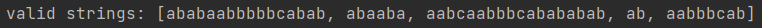
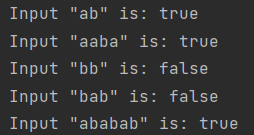

# Intro to formal languages. Regular grammars. Finite Automata.

### Course: Formal Languages & Finite Automata
### Author: Guzun Grigore

----

## Theory
Formal languages theory is a branch of computer science that deals with the study of formal languages and their properties. A formal language is a set of strings of symbols that have been defined according to some specific rules. Formal languages are used in various areas of computer science, including programming languages, compilers, and natural language processing.

Regular grammars are a type of formal grammar that generates a regular language, which is a language that can be recognized by a finite automaton. A regular grammar is a set of production rules that can be used to generate all the strings in a regular language. The production rules for a regular grammar are typically of the form A → aB or A → a, where A and B are non-terminal symbols and a is a terminal symbol.

Finite automata are machines that can recognize regular languages. A finite automaton is a mathematical model that consists of a finite set of states, a set of input symbols, a transition function that maps a state and an input symbol to a new state, and a set of accepting states. Finite automata come in two varieties: deterministic finite automata (DFAs) and non-deterministic finite automata (NFAs). DFAs have a unique next state for every input symbol, whereas NFAs may have multiple next states for a given input symbol.

DFAs and NFAs are equivalent in terms of their language recognition capabilities. That is, any language recognized by a DFA is also recognized by an NFA, and vice versa. However, NFAs are often simpler to construct for certain languages, as they can handle more complex patterns and require fewer states. DFAs are often preferred in practice, as they are more efficient to execute and use less memory.

Regular grammars and finite automata are closely related. A regular grammar generates a regular language, which can be recognized by a finite automaton. Conversely, every regular language can be generated by a regular grammar, and can be recognized by a finite automaton. This relationship between regular grammars and finite automata is known as the Chomsky hierarchy, which is a classification of formal languages into four types based on the expressive power of their corresponding grammars. Regular languages are the simplest type of formal language in this hierarchy.


## Objectives:

* Understand what a language is and what it needs to have in order to be considered a formal one.

* Provide the initial setup for the evolving project that you will work on during this semester. I said project because usually at lab works, I encourage/impose students to treat all the labs like stages of development of a whole project. Basically you need to do the following:

    * Create a local && remote repository of a VCS hosting service (let us all use Github to avoid unnecessary headaches);

    * Choose a programming language, and my suggestion would be to choose one that supports all the main paradigms;

    * Create a separate folder where you will be keeping the report. This semester I wish I won't see reports alongside source code files, fingers crossed;

* According to your variant number (by universal convention it is register ID), get the grammar definition and do the following tasks:

  * Implement a type/class for your grammar;

  * Add one function that would generate 5 valid strings from the language expressed by your given grammar;

  * Implement some functionality that would convert and object of type Grammar to one of type Finite Automaton;

  * For the Finite Automaton, please add a method that checks if an input string can be obtained via the state transition from it;


## Implementation description

The generateString function is a method that creates a random string based on the given grammar using recursion. It takes a symbol as input and uses it to retrieve a list of possible productions for that symbol from the productions map. If the symbol is a terminal symbol, the function returns the symbol as is. Otherwise, it randomly selects a production from the list and splits it into individual symbols. The function then recursively calls itself for each symbol in the chosen production until a terminal symbol is reached. The function concatenates the results of the recursive calls to build the generated string and returns the string to the caller once the recursion is complete.

```
private String generateString(String symbol) {
        if (VT.contains(symbol)) {
            return symbol;
        }

        List<String> possibleProductions = productions.get(symbol);
        String chosenProduction = possibleProductions.get(new Random().nextInt(possibleProductions.size()));
        String[] productionSymbols = chosenProduction.split("");
        StringBuilder sb = new StringBuilder();
        for (String s : productionSymbols) {
            sb.append(generateString(s));
        }
        return sb.toString();
    }
```

The FiniteAutomaton class represents a deterministic finite automaton (DFA). The class is initialized with a set of states, a set of accepting states, a map of transitions, and an initial state. The accepts method takes a string input and returns a boolean indicating whether the input is accepted by the DFA. The method iterates over the characters in the input string and follows the transitions specified by the transition map until the end of the string is reached. If the final state is an accepting state, the input is accepted, otherwise it is rejected. The class assumes that the input only contains characters that are specified in the transition map.
```
public boolean accepts(String input) {
        String currentState = initialState;
        for (char c : input.toCharArray()) {
            if (!transitions.get(currentState).containsKey(Character.toString(c))) {
                return false;
            }
            currentState = transitions.get(currentState).get(Character.toString(c));
        }
        return acceptingStates.contains(currentState);
    }
```

The main method creates two objects: a Grammar object and a FiniteAutomaton object.
The Grammar object is created using a set of non-terminal symbols (VN), a set of terminal symbols (VT), a map of productions (productions), and a start symbol ("S"). The Grammar object is used to generate a list of five valid strings by calling the generateValidStrings method and passing in the number of valid strings to generate. The generated strings are then printed to the console.



The FiniteAutomaton object is created using a set of states (states), a set of accepting states (acceptingStates), a map of transitions (transitions), and an initial state ("q0"). The FiniteAutomaton object is used to test whether each of the five input strings is accepted by the automaton by calling the accepts method for each input string. The result of each test is printed to the console.



## Conclusion

In conclusion, formal languages, regular grammars, and finite automata are important concepts in computer science and are widely used in various areas such as programming language design, compilers, and natural language processing. Understanding these concepts is essential for developing efficient algorithms and designing systems that process and analyze languages.

A regular grammar is a set of rules for generating strings in a language, and it can be represented using a finite automaton. A finite automaton is a machine that can recognize a regular language, which is a set of strings generated by a regular grammar. The transition function of the finite automaton defines how the machine moves from one state to another based on the input it receives.

Regular languages have many applications in computer science, such as pattern matching, lexical analysis, and parsing. Understanding the concepts of regular grammars and finite automata is crucial for computer science students and professionals who work in these areas.

## References

[LFPC_Guide](https://else.fcim.utm.md/pluginfile.php/110458/mod_resource/content/0/LFPC_Guide.pdf)

[Conversion to Finite Automaton](https://www.geeksforgeeks.org/conversion-of-regular-expression-to-finite-automata/)