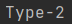
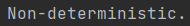
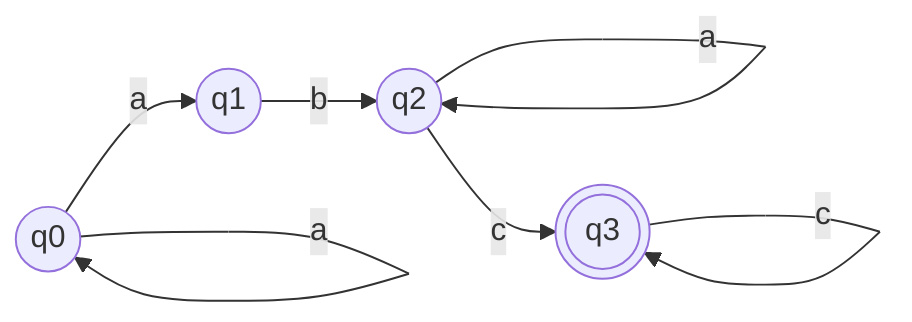

# Determinism in Finite Automata. Conversion from NDFA to DFA. Chomsky Hierarchy.

### Course: Formal Languages & Finite Automata
### Author: Guzun Grigore

----

## Theory
The concept of determinism is important in finite automata, which are mathematical models of computation used in computer
science and mathematics. A finite automaton comprises a set of states, an input alphabet, a transition function, and a 
start state and one or more final states. In a deterministic finite automaton (DFA), there is only one next state for each
state and input symbol, ensuring a unique output for a given input.

In contrast, a nondeterministic finite automaton (NFA) can have multiple transitions from a given state and input symbol.
A DFA is a more powerful machine than an NFA, and every NFA can be converted to a DFA using a process called subset construction.
This involves creating a new DFA state for each set of NFA states that can be reached by following ε-moves and then transitions
on input symbols, and defining transitions between these states based on input symbols.

The Chomsky hierarchy is a classification of formal grammars used to describe the syntax of formal languages. The hierarchy
is divided into four types of grammars, each with increasing generative power: Type-0 (unrestricted), Type-1 (context-sensitive),
Type-2 (context-free), and Type-3 (regular). Each type of grammar corresponds to a type of automaton that can recognize the
language generated by the grammar, with Type-0 grammars recognized by Turing machines, Type-1 grammars recognized by
linear-bounded automata, Type-2 grammars recognized by pushdown automata, and Type-3 grammars recognized by finite automata.
Linguist Noam Chomsky proposed this hierarchy in the 1950s.

## Objectives:

* Understand what an automaton is and what it can be used for.

* Continuing the work in the same repository and the same project, the following need to be added:
    * a. Provide a function in your grammar type/class that could classify the grammar based on Chomsky hierarchy.
    * b. For this you can use the variant from the previous lab.

* According to your variant number (by universal convention it is register ID), get the finite automaton definition and do the following tasks:
    * a. Implement conversion of a finite automaton to a regular grammar.
    * b. Determine whether your FA is deterministic or non-deterministic.
    * c. Implement some functionality that would convert an NDFA to a DFA.
    * d. Represent the finite automaton graphically (Optional, and can be considered as a bonus point):
        * You can use external libraries, tools or APIs to generate the figures/diagrams.
        * Your program needs to gather and send the data about the automaton and the lib/tool/API return the visual representation.

## Implementation description

The method called classifyGrammar() initially examines whether the grammar being analyzed is of Type-0, which is the broadest
type of grammar that can create any language that a Turing machine can recognize. If the grammar has a production with a left-hand
side that is empty, it can produce the empty language, which is a Type-0 language. In the event that the grammar is indeed of Type-0,
the method outputs "Type-0".

In case the grammar does not belong to Type-0, the classifyGrammar() method then moves on to verify if it falls under Type-1,
which pertains to context-sensitive languages. To be classified as Type-1, a grammar's productions must be in the form of αBβ -> αγβ,
where α and β are combinations of terminals and non-terminals, B is a non-terminal, and γ's length must be greater than or equal
to B's length. If the grammar satisfies these requirements, the method outputs "Type-1".

If the grammar does not fall under Type-1, the classifyGrammar() method then proceeds to inspect whether it is of Type-2,
which is associated with context-free languages. To be classified as Type-2, a grammar's productions must be in the form 
of A -> α, where A is a non-terminal and α is a combination of terminals and non-terminals. If all productions have only
one non-terminal on the left-hand side, the grammar is considered to be Type-2. In case the grammar meets these criteria,
the method outputs "Type-2".

If the grammar is not identified as Type-0, Type-1, or Type-2, it is necessarily categorized as Type-3, which relates to regular languages.

```
public String classifyGrammar() {
        for (String leftSymbol : productions.keySet()) {
            if (productions.get(leftSymbol).contains("")) {
                return "Type-0";
            }
        }

        for (String leftSymbol : productions.keySet()) {
            for (String production : productions.get(leftSymbol)) {
                String[] sides = production.split(" ");
                if (sides.length == 1) {
                    continue; // Skip productions of the form A -> ε
                }
                String lhs = sides[0];
                String rhs = production.substring(lhs.length() + 1);
                if (lhs.length() <= rhs.length()) {
                    return "Type-1";
                }
            }
        }

        for (String leftSymbol : productions.keySet()) {
            for (String production : productions.get(leftSymbol)) {
                String[] sides = production.split(" ");
                if (sides.length == 1 && VN.contains(leftSymbol)) {
                    return "Type-2";
                }
            }
        }

        return "Type-3";
    }
```

---

The function toRegularGrammar() is responsible for creating a regular grammar that can produce the same language as the 
given nondeterministic finite automaton (NFA). To accomplish this, the code iterates over each transition defined in the
NFA's delta map and generates a production for each one. The production is created by concatenating the input symbol and
the state that it transitions to. The newly generated production is then added to the list of productions for the "from"
state in the productions map. If the "from" state does not yet have any productions, an empty list is created to store them.
Finally, the input symbol is added to the set of terminals.
```
    for (Pair<String, String> transition : delta.keySet()) {
        String fromState = transition.getFirst();
        String inputSymbol = transition.getSecond();
        String toState = delta.get(transition);

        String production = inputSymbol + " " + toState;

        if (!productions.containsKey(fromState)) {
            productions.put(fromState, new ArrayList<String>());
        }
        productions.get(fromState).add(production);

        VT.add(inputSymbol);
    }
```

In this section, each final state in the NFA (stored in F set) is iterated over, and an empty production is added to the
list of productions for that state in the productions map. If the state does not already have any productions, it creates
an empty list to store them.

The code adds a new non-terminal to the productions map for the start symbol and creates a production for the start
symbol that begins with the initial state of the NFA (q0). Finally, it generates and returns a new Grammar object with
the VN, VT, productions, and startSymbol variables.
```
    for (String q : F) {
        if (!productions.containsKey(q)) {
            productions.put(q, new ArrayList<String>());
        }
        productions.get(q).add("");
    }

    productions.put(startSymbol, new ArrayList<String>());
    productions.get(startSymbol).add(q0);

    return new Grammar(VN, VT, productions, startSymbol);
```
---

The isDeterministic function returns a Boolean value indicating whether the given finite automaton (FA) is deterministic
or not. It achieves this by using the getNextStates method to get the set of states that can be reached from each state
q with input symbol a. If any of these sets have a size different from 1, the FA is not deterministic, and the function
returns false. If all sets have exactly one element, the function returns true, indicating that the FA is deterministic.
It's important to note that this method assumes that the FA is complete, meaning that there is at least one transition
defined for each state and input symbol. If the FA is incomplete, the method may incorrectly return false even if the FA is deterministic.

```

public boolean isDeterministic() {
    for (String q : Q) {
        for (String a : Sigma) {
            Set<String> nextStates = getNextStates(q, a);
            if (nextStates.size() != 1) {
                return false;
            }
        }
    }
    return true;
}
```

---
The toDFA() function generates a new DFA object that recognizes the same language as the given NFA. This is achieved by 
creating a few variables: a dfaStates map that keeps track of the new states, a dfaDelta map that records the transitions
between the states, a visited set that keeps track of the processed states, and dfaQ0 and dfaF variables that store the
initial and final states of the DFA, respectively.

Initially, the method creates the starting state of the DFA, which is a set that contains only the initial state of the NFA.
This state is added to the dfaStates map, and also to a queue of states that are yet to be processed.
```
Queue<Set<String>> queue = new LinkedList<>();
        queue.add(initialState);

while (!queue.isEmpty()) {
Set<String> currentState = queue.poll();

            
            visited.add(currentState);

            String dfaStateName = dfaStates.get(currentState);
            for (String q : currentState) {
                if (F.contains(q)) {
                    dfaF.add(dfaStateName);
                    break;
                }
            }
```

The method toDFA() is responsible for generating a new DFA object that has the same language as the input NFA.
In order to do this, it creates a few variables and data structures such as dfaStates map, dfaDelta map, visited set, and dfaQ0 and dfaF variables.

Initially, it creates the starting state of the DFA as a set containing only the starting state of the NFA.
Then, it adds this state to the dfaStates map and to a queue of states that are yet to be processed.

The while loop then iterates over each state in the queue, and creates new states in the DFA for each set of states that
can be reached from the current state in the NFA. This is done by calculating the set of next states for each input symbol,
creating a new state in the DFA if necessary, and adding a transition to the dfaDelta map.

To avoid processing the same set of states multiple times, the visited set is used, and the dfaStates map is used to keep
track of the name of each state in the DFA. The name is generated using the getNextStateName() method, which takes an integer
count as input and generates a unique name for each new state using a sequence of capital letters. The number of characters
needed for the name is computed, and each character is generated using modular arithmetic.

```
private String getNextStateName(int count) {
        int numChars = 1;
        while (count > Math.pow(26, numChars)) {
            count -= Math.pow(26, numChars);
            numChars++;
        }
        StringBuilder sb = new StringBuilder();
        for (int i = 0; i < numChars; i++) {
            int digit = (count / (int) Math.pow(26, numChars - i - 1)) % 26;
            sb.append((char) ('A' + digit));
        }
        return sb.toString();
    }
```
In summary, the toDFA() method converts a given NFA into a DFA. It creates a new DFA object and initializes its variables.
It starts with the initial state of the DFA as a set containing only the initial state of the NFA. It then computes the 
set of next states for each input symbol, creates new states in the DFA if necessary, and adds transitions to the dfaDelta map.
It uses the visited set to avoid processing the same set of states multiple times and the dfaStates map to keep track of 
the name of each state in the DFA. Finally, it returns the new DFA object.
```
Set<String> dfaQ = new HashSet<>(dfaStates.values());
        return new DFA(dfaQ, Sigma, dfaDelta, dfaQ0, dfaF);
```

To clarify, a complete NFA is one where for every state and input symbol there is at least one transition defined.
Incomplete NFAs are allowed in some contexts, but in this particular implementation of the toDFA() method, an incomplete
NFA may cause issues. Specifically, if getNextStates() is called on a state with an input symbol for which no transition
is defined, it will return an empty set of next states. This can lead to incorrect behavior in the creation of the DFA.
Therefore, if the input NFA is not complete, it should be converted to a complete NFA first, for example by adding an "epsilon"
transition from every state to a new "dead" state that has transitions to itself for every input symbol.

## Results
1. Provide a function in your grammar type/class that could classify the grammar based on Chomsky hierarchy.
```
Variant 21:
VN={S, B, C, D},
VT={a, b, c}, 
P={ 
    S → aB     
    B → bS    
    B → aC   
    B → b    
    C → bD   
    D → a    
    D → bC
    D → cS
}
```
Output:


---
2. Determine whether your FA is deterministic or non-deterministic
```
Variant 20
Q = {q0,q1,q2,q3},
∑ = {a,b,c},
F = {q3},
δ(q0,a) = q0,
δ(q0,a) = q1,
δ(q2,a) = q2,
δ(q1,b) = q2,
δ(q2,c) = q3,
δ(q3,c) = q3.
```
output:



3. Represent the finite automaton graphically


## Conclusion

To summarize, formal language theory is an interdisciplinary field that focuses on the study of formal languages and 
their properties. This involves analyzing grammars, automata, and their interrelationships. The Chomsky hierarchy
categorizes formal grammars into four types based on the complexity of the languages they can generate, with regular
grammars being the simplest and unrestricted grammars being the most complex. The algorithms used for converting between
different types of automata and grammars are critical in various fields of computer science such as compilers, natural
language processing, and artificial intelligence. It is essential for professionals working in these fields to have a
thorough understanding of the Chomsky hierarchy and automata and grammar conversion algorithms.
## References

[Guide](https://else.fcim.utm.md/pluginfile.php/110458/mod_resource/content/0/LFPC_Guide.pdf)