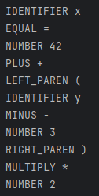
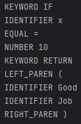
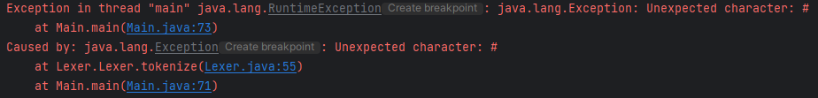

# Topic: Lexer & Scanner

### Course: Formal Languages & Finite Automata
### Author: Guzun Grigore, FAF-213

---

## Theory
A lexer, short for "lexical analyzer", is a fundamental component of a compiler or interpreter that breaks down source 
code into its individual lexical units, or "tokens". The lexer takes in the raw source code as input and generates a 
stream of tokens that are subsequently consumed by the parser.

The tokens produced by the lexer are usually defined by a formal grammar or regular expressions that describe the syntax
of the programming language being analyzed. Some examples of tokens include keywords (e.g. "if", "else", "while"), 
identifiers (e.g. variable and function names), literals (e.g. numeric and string literals), and punctuation symbols
(e.g. parentheses, semicolons).

The process of lexical analysis typically involves scanning the input source code character by character, identifying 
and categorizing each character into its corresponding token. The lexer uses a state machine to keep track of its 
current position in the input stream and its current mode or state, depending on the context of the code being analyzed.

---

## Objective:
* Understand what lexical analysis [1] is.
* Get familiar with the inner workings of a lexer/scanner/tokenizer.
* Implement a sample lexer and show how it works.

---

## Implementation description
The code below is a method named tokenize() which returns a list of Token objects.

The method enters a loop that will continue as long as the current position in the input string is less than the 
length of the string. The current character in the input string is retrieved using the charAt() method of the String class.

The code then checks the type of the current character using a series of if statements. If the character is a digit,
the parseNumber() method is called to extract a number from the input string, and a new Token object with 
TokenType.NUMBER and the extracted number than its value is added to the tokens list. If the character is a letter,
the parseIdentifier() method is called to extract an identifier from the input string, and a new Token object with 
either TokenType.KEYWORD or TokenType.IDENTIFIER (depending on whether the identifier is a reserved keyword) and the
extracted identifier as its value is added to the tokens list. If the character is one of the following punctuation 
symbols - `(, ), +, -, *, /, or =` - a new Token object with the corresponding TokenType and the character as its value
is added to the tokens list. If the character is a space, the position is incremented without adding a new token. 
Finally, if none of these conditions are met, an exception is thrown.

After the loop completes, the list of Token objects is returned.

```
public List<Token> tokenize() throws Exception {
        List<Token> tokens = new ArrayList<>();

        while (position < input.length()) {
            char currentChar = input.charAt(position);

            if (Character.isDigit(currentChar)) {
                String number = parseNumber();
                tokens.add(new Token(TokenType.NUMBER, number));
            } else if (Character.isLetter(currentChar)) {
                String identifier = parseIdentifier();
                TokenType type = TokenType.KEYWORD;
                if (!Keyword.isKeyword(identifier)) {
                    type = TokenType.IDENTIFIER;
                }
                tokens.add(new Token(type, identifier));
            } else if (currentChar == '(') {
                tokens.add(new Token(TokenType.LEFT_PAREN, "("));
                position++;
            } else if (currentChar == ')') {
                tokens.add(new Token(TokenType.RIGHT_PAREN, ")"));
                position++;
            } else if (currentChar == '+') {
                tokens.add(new Token(TokenType.PLUS, "+"));
                position++;
            } else if (currentChar == '-') {
                tokens.add(new Token(TokenType.MINUS, "-"));
                position++;
            } else if (currentChar == '*') {
                tokens.add(new Token(TokenType.MULTIPLY, "*"));
                position++;
            } else if (currentChar == '/') {
                tokens.add(new Token(TokenType.DIVIDE, "/"));
                position++;
            } else if (currentChar == '=') {
                tokens.add(new Token(TokenType.EQUAL, "="));
                position++;
            } else if (currentChar == ' ') {
                position++;
            } else {
                throw new Exception("Unexpected character: " + currentChar);
            }
        }

        return tokens;
    }
```
---
'parseNumber()' is a private method that returns a String. It is used to extract a contiguous sequence of digits from the input string.

```
private String parseNumber() {
        int start = position;
        while (position < input.length() && Character.isDigit(input.charAt(position))) {
            position++;
        }
        return input.substring(start, position);
    }
```

The method starts by initializing a variable start to the current position in the input string. It then enters a loop that continues as long as the current position is less than the length of the input string and the current character is a digit. In the loop, the method increments the position variable, which is a class-level variable that keeps track of the current position in the input string.

Once the loop terminates, the method returns a substring of the input string that starts at start and ends at position. This substring contains the contiguous sequence of digits that was found in the input string.

Here's an example usage of the 'parseNumber()' method:
```
input = "123 + 456";
position = 0;

String number = parseNumber(); // returns "123"
```
---
'parseIdentifier()' is another private method that returns a String. It is used to extract a contiguous sequence of letters and/or digits (and underscores) from the input string.

```
    private String parseIdentifier() {
        int start = position;
        while (position < input.length() && (Character.isLetterOrDigit(input.charAt(position)) || input.charAt(position) == '_')) {
            position++;
        }
        return input.substring(start, position);
    }
```

The method starts by initializing a variable start to the current position in the input string. It then enters a loop that continues as long as the current position is less than the length of the input string and the current character is a letter, digit, or underscore. In the loop, the method increments the position variable, which is a class-level variable that keeps track of the current position in the input string.

Once the loop terminates, the method returns a substring of the input string that starts at start and ends at position. This substring contains the contiguous sequence of letters and/or digits that was found in the input string.

Here's an example usage of the parseIdentifier() method:

```
input = "x = 42";
position = 0;

String identifier = parseIdentifier(); // returns "x"
```

---

The TokenType enum defines a set of constants that represent the different types of tokens that can be generated by a lexer. Each constant represents a different type of token, such as a number, an identifier, a keyword, a left parenthesis, a right parenthesis, and various arithmetic operators.

Enums in Java are a way of defining a set of related constants as a single data type. In this case, TokenType is the data type and each constant is an instance of that data type. Enums are commonly used in Java to represent a set of related constants that can be used throughout a program.

```
public enum TokenType {
    NUMBER,
    IDENTIFIER,
    KEYWORD,
    LEFT_PAREN,
    RIGHT_PAREN,
    PLUS,
    MINUS,
    MULTIPLY,
    DIVIDE,
    EQUAL
}
```

---

The Keyword enum defines a set of constants that represent the different keywords in a programming language, such as if, else, while, for, and return.

The enum also provides a static method called isKeyword() that takes a String value as input and returns a boolean indicating whether that value is a keyword or not. The method does this by iterating over all the values in the Keyword enum and comparing each value to the input string using case-insensitive comparison.

Enums in Java can also have methods, just like regular classes. In this case, the isKeyword() method is a utility method that can be used to check whether a given string is a keyword or not. The method is static, meaning it can be called without creating an instance of the Keyword enum.

```
public enum Keyword {
    IF,
    ELSE,
    WHILE,
    FOR,
    RETURN;

    public static boolean isKeyword(String value) {
        for (Keyword keyword : values()) {
            if (keyword.name().equalsIgnoreCase(value)) {
                return true;
            }
        }
        return false;
    }
}
```

## Results

Input:

`x = 42 + (y - 3) * 2`

Output:



Input:

`IF x = 10 RETURN (Good Job)`

Output: 



Input:

`10 * 3 # 30`

Output:



## Conclusion

In conclusion, a lexer is an important component of a compiler or interpreter that breaks down input source code into a sequence of tokens, which can then be used by the parser to construct an abstract syntax tree. The lexer reads input source code character by character and groups them into tokens based on a set of predefined rules.

The implemented code is a simple lexer written in Java that can tokenize a basic arithmetic expression. The tokenize() method reads input source code character by character and groups them into different types of tokens using a set of predefined rules. The parseNumber() and parseIdentifier() methods are helper methods that parse the input source code to extract a number or identifier token. The TokenType enum and Keyword enum provide a set of constants that represent the different types of tokens and keywords in the programming language.

Overall, the lexer plays a critical role in the compilation process and is an essential component of any compiler or interpreter.

## References

[1] [A sample of a lexer implementation](https://llvm.org/docs/tutorial/MyFirstLanguageFrontend/LangImpl01.html)

[Lexer Analysis](https://en.wikipedia.org/wiki/Lexical_analysis)

[Introduction of Lexical Analysis](https://www.geeksforgeeks.org/introduction-of-lexical-analysis/)