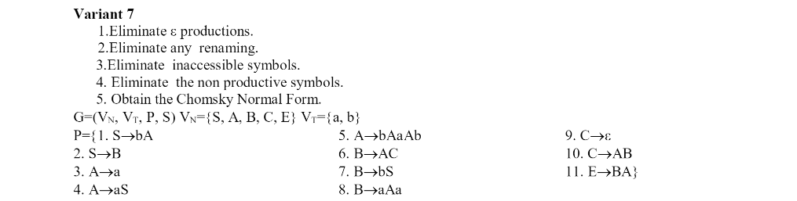

# Topic: Chomsky Normal Form

### Course: Formal Languages & Finite Automata
### Author: Guzun Grigore, FAF-213

---

## Theory

Chomsky Normal Form (CNF) is a standard form for context-free grammars, which are a type of formal grammar widely used in
natural language processing and computer science. CNF was introduced by the linguist and computer scientist Noam Chomsky
as a way to simplify the representation and analysis of context-free grammars.

In CNF, every non-terminal symbol (variable) in the grammar has only two types of production rules:
1. A → BC
2. A → a

where A, B, and C are non-terminal symbols, and a is a terminal symbol (a symbol that appears in the language). The first
type of rule generates two non-terminal symbols on the right-hand side, and the second type of rule generates a terminal symbol.

CNF has several properties that make it useful in natural language processing and computer science. For example:

1. CNF eliminates useless symbols and rules. Useless symbols are symbols that cannot be used to generate any string in 
the language, while useless rules are rules that cannot be reached from the start symbol or do not contribute to the
language. By converting a context-free grammar to CNF, we can remove these unnecessary symbols and rules.

2. CNF simplifies parsing algorithms. Many parsing algorithms for context-free grammars, such as the CYK algorithm, are 
more efficient when the grammar is in CNF. This is because the structure of the grammar is simplified, and the parsing
algorithm can take advantage of this simplification to reduce the number of possible parse trees.

3. CNF enables the use of more powerful algorithms. Some algorithms for context-free grammars, such as the Earley parser,
require that the grammar be in CNF to work correctly. By converting a context-free grammar to CNF, we can take advantage
of these more powerful algorithms.

Converting a context-free grammar to CNF can be done using a series of standard transformations, such as removing epsilon
rules and unit productions, and introducing new non-terminal symbols as necessary. The resulting grammar may be larger 
than the original grammar, but it will be easier to analyze and manipulate.

---

## Objective:

1. Learn about Chomsky Normal Form (CNF) [1].
2. Get familiar with the approaches of normalizing a grammar.
3. Implement a method for normalizing an input grammar by the rules of CNF.
   1. The implementation needs to be encapsulated in a method with an appropriate signature (also ideally in an appropriate class/type).
   2. The implemented functionality needs executed and tested.
   3. A BONUS point will be given for the student who will have unit tests that validate the functionality of the project.
   4. Also, another BONUS point would be given if the student will make the aforementioned function to accept any grammar, not only the one from the student's variant.

---

## Implementation description

The purpose of eliminateEpsilonProductions() method is to eliminate epsilon (ε) productions from the grammar, which are production rules that generate the empty string.

The method starts by creating a set of nullable symbols, which are symbols that can be eliminated by applying epsilon productions. It then iterates through the production rules of the grammar, and for each rule that contains ε, it adds the left-hand side symbol to the nullable set.

Next, the method creates a new map of productions that will replace the old map of productions. It iterates through the old map of productions, and for each production rule, it generates a list of new production rules that replace the original rule. It does this by iterating through the symbols in the original rule and checking if each symbol is nullable. If a symbol is nullable, it generates a new production rule by removing the nullable symbol from the original rule. The method also adds the original rule to the list of new production rules, to ensure that all non-nullable rules are preserved.

After generating the list of new production rules for a given symbol, the method removes any empty strings from the list, as these are not valid production rules.

Finally, the method updates the map of productions with the new map of productions that was generated. The effect of this is to eliminate all ε productions from the grammar.

```
public void eliminateEpsilonProductions() {
        Set<String> nullables = new HashSet<>();
        for (Map.Entry<String, List<String>> entry : productions.entrySet()) {
            if (entry.getValue().contains("ε")) {
                nullables.add(entry.getKey());
            }
        }

        Map<String, List<String>> newProductions = new HashMap<>();
        for (Map.Entry<String, List<String>> entry : productions.entrySet()) {
            String variable = entry.getKey();
            List<String> oldProductions = entry.getValue();
            List<String> newProductionsList = new ArrayList<>();

            for (String production : oldProductions) {
                if (!production.equals("ε")) {
                    boolean addProduction = true;
                    for (String nullable : nullables) {
                        if (production.contains(nullable.toString())) {
                            String newProduction = production.replace(nullable.toString(), "");
                            if (!newProductionsList.contains(newProduction)) {
                                newProductionsList.add(newProduction);
                            }
                        }
                    }
                    if (!newProductionsList.contains(production)) {
                        newProductionsList.add(production);
                    }
                }
            }

            Iterator<String> iterator = newProductionsList.iterator();
            while (iterator.hasNext()) {
                String production = iterator.next();
                if (production.equals("")) {
                    iterator.remove();
                }
            }

            newProductions.put(variable, newProductionsList);
        }

        productions = newProductions;
    }
```

The next method eliminateUnitProductions(), eliminates all unit productions from the grammar, which are production rules that have exactly one nonterminal symbol on the right-hand side.

The method iterates through each symbol in the production rules of the grammar. For each symbol, it generates a list of all unit productions associated with that symbol. It then enters a loop that removes each unit production one-by-one and replaces it with the productions of the nonterminal on the right-hand side.

For each unit production, the method first removes it from the list of productions associated with the symbol. It then iterates through the productions of the nonterminal on the right-hand side of the unit production and adds them to the list of productions associated with the original symbol, if they are not already present. Finally, the method iterates through the productions of the original symbol and adds any unit productions that are found to the list of unit productions to be processed.

The loop continues until all unit productions have been eliminated from the grammar.

---

```
 public void eliminateUnitProductions() {
        for (String symbol : this.productions.keySet()) {
            List<String> unit_productions = new ArrayList<>();
            for (String prod : this.productions.get(symbol)) {
                if (prod.length() == 1 && Character.isUpperCase(prod.charAt(0))) {
                    unit_productions.add(prod);
                }
            }

            while (!unit_productions.isEmpty()) {
                String unit = unit_productions.remove(0);
                this.productions.get(symbol).remove(unit);
                for (String prod : this.productions.get(unit)) {
                    if (!this.productions.get(symbol).contains(prod)) {
                        this.productions.get(symbol).add(prod);
                    }
                }
                for (String prod : this.productions.get(symbol)) {
                    if (prod.length() == 1 && Character.isUpperCase(prod.charAt(0))) {
                        unit_productions.add(prod);
                    }
                }
            }
        }
    }
```

---

Continuing from the previous explanation, after we've eliminated unit productions, the next step in transforming a context-free grammar into Chomsky Normal Form is to eliminate any symbols that are not accessible from the start symbol. In other words, we want to remove any nonterminal symbols that cannot be reached by any sequence of productions from the start symbol.

To achieve this, the eliminateInaccessibleSymbols() method starts by initializing a visited set with the start symbol, and then invoking the visit() method with the start symbol and the visited set. The visit() method recursively visits all the nonterminal symbols that are reachable from the given symbol and adds them to the visited set.

Once all reachable symbols have been added to visited, the method creates a new set of nonterminal symbols and a new set of productions, containing only those symbols and productions that were visited during the visit() process. These new sets are then assigned to the grammar object, effectively eliminating any symbols that are not accessible from the start symbol.

```
public void eliminateInaccessibleSymbols() {
        Set<String> visited = new HashSet<>();
        visit(this.startSymbol, visited);

        List<String> newNonTerminal = new ArrayList<>();
        Map<String, List<String>> newProductions = new HashMap<>();
        for (String nt : this.nonTerminal) {
            if (visited.contains(nt)) {
                newNonTerminal.add(nt);
                newProductions.put(nt, this.productions.get(nt));
            }
        }

        this.nonTerminal = newNonTerminal;
        this.productions = newProductions;
    }

    private void visit(String symbol, Set<String> visited) {
        if (!visited.contains(symbol)) {
            visited.add(symbol);
            for (String prod : this.productions.get(symbol)) {
                for (int i = 0; i < prod.length(); i++) {
                    String s = prod.charAt(i) + "";
                    if (this.nonTerminal.contains(s)) {
                        visit(s, visited);
                    }
                }
            }
        }
    }
```

---

After eliminating any inaccessible symbols, the next step in the context-free grammar simplification process is to eliminate nonproductive symbols. Nonproductive symbols are those that cannot be derived from the start symbol of the grammar, meaning that they do not lead to any terminal symbols. To eliminate nonproductive symbols, we first need to find all productive symbols - those that can lead to a derivation of terminal symbols.

The method eliminateNonproductive() performs this task by iterating over the grammar's productions and checking each nonproductive symbol to see if any of its productions consist entirely of productive symbols. This process is repeated until no new productive symbols are found. Once all productive symbols are identified, we can remove any nonproductive symbols from the grammar's non-terminal set and productions.

The method first initializes a productive set with the start symbol, and an oldProductive set to an empty set. It then enters a loop that continues until oldProductive is equal to productive. In each iteration, the method updates oldProductive to contain the same elements as productive, indicating that we've finished looking for new productive symbols. The method then iterates over the grammar's productions, checking for any symbols that are not already in productive, and attempting to add them if they have a production consisting only of productive symbols. This process continues until no new productive symbols are added to productive.

After finding all productive symbols, the method removes any nonproductive symbols from the grammar's non-terminal set and productions. Finally, the method iterates over the productions again to remove any nonproductive productions.

The end result is a simplified context-free grammar that contains only productive symbols and productions that can lead to terminal symbols.

```
public void eliminateNonproductive() {
        Set<String> productive = new HashSet<>();
        productive.add(startSymbol);
        Set<String> oldProductive = new HashSet<>();

        while (!oldProductive.equals(productive)) {
            oldProductive = new HashSet<>(productive);
            for (Map.Entry<String, List<String>> entry : productions.entrySet()) {
                String symbol = entry.getKey();
                List<String> rhs = entry.getValue();
                if (!productive.contains(symbol)) {
                    for (String prod : rhs) {
                        boolean allInProductive = true;
                        for (char s : prod.toCharArray()) {
                            if (!productive.contains(String.valueOf(s)) && !terminals.contains(String.valueOf(s))) {
                                allInProductive = false;
                                break;
                            }
                        }
                        if (allInProductive) {
                            productive.add(symbol);
                            break;
                        }
                    }
                }
            }
        }

        Set<String> nonproductive = new HashSet<>(nonTerminal);
        nonproductive.removeAll(productive);

        for (String symbol : nonproductive) {
            productions.remove(symbol);
        }

        for (Map.Entry<String, List<String>> entry : productions.entrySet()) {
            String symbol = entry.getKey();
            List<String> rhs = entry.getValue();
            List<String> newRhs = new ArrayList<>();
            for (String prod : rhs) {
                boolean allInProductive = true;
                for (char s : prod.toCharArray()) {
                    if (!productive.contains(String.valueOf(s)) && !terminals.contains(String.valueOf(s))) {
                        allInProductive = false;
                        break;
                    }
                }
                if (allInProductive) {
                    newRhs.add(prod);
                }
            }
            productions.put(symbol, newRhs);
        }

        List<String> productiveList = new ArrayList<>(productive);
        Collections.sort(productiveList);
        nonTerminal = productiveList;
    }
```

---

In the end, after we eliminated all the Epsilon Productions, Unit Productions, Inaccessible Symbols and
Nonproductive characters, we got to transform all this grammar in Chomsky's Normal Form where every production is either
of the form A -> BC or A -> a, where A, B, and C are non-terminal symbols, and a is a terminal symbol.

The toCnf() function first creates an empty HashMap called newProductions, which will be used to store the new productions
after converting the original grammar into CNF. It also initializes two integer variables called nextNewVarX and nextNewVarT
to 1, which will be used to generate new variable names.

The function then iterates over each non-terminal symbol in the original grammar. For each non-terminal symbol, it creates
a new ArrayList of productions and adds it to the newProductions HashMap.

For each production of the non-terminal symbol, the function checks if the length of the production is greater than or equal
to 3. If it is, then the production is split into smaller productions that can be represented in CNF. To do this, the function
generates a new set of variables (labeled X1, X2, etc.), one for each non-terminal symbol in the original production (excluding
the first and last symbols). It then adds these new variables to the nonTerminal HashSet, which represents the set of all 
non-terminal symbols in the grammar.

The function then creates new productions that replace the original production with the new variables and terminals. 
Specifically, it adds a new production that maps the original non-terminal symbol to the first variable and the first 
symbol in the original production. It then adds a set of new productions that map each new variable to the symbol that
follows it in the original production and the next variable. Finally, it adds a new production that maps the last new 
variable to the last symbol in the original production.

If the original production is of length 2 and both symbols are non-terminals, then the function adds this production as
is to the newProductions HashMap.

If the production is of length 1 or contains a terminal symbol, then the function creates a new variable to represent 
the terminal symbol. It adds the new variable to the nonTerminal HashSet, and adds a new production to the newProductions
HashMap that maps the original non-terminal symbol to the new variable.

The function then updates the productions and nonTerminal fields of the grammar object to reflect the new productions and
non-terminals generated by the function. The productions field is set to the newProductions HashMap, and the nonTerminal
field is set to a new ArrayList that contains all the non-terminal symbols in the nonTerminal HashSet, sorted in lexicographic order.

```
public void toCnf() {
        Map<String, List<String>> newProductions = new HashMap<>();
        int nextNewVarX = 1;
        int nextNewVarT = 1;
        Map<String, String> terminalVarMap = new HashMap<>();

        for (String var : productions.keySet()) {
            newProductions.put(var, new ArrayList<String>());

            for (String prod : productions.get(var)) {
                if (prod.length() >= 3) {
                    List<String> prodVars = new ArrayList<>();
                    for (int i = 0; i < prod.length() - 1; i++) {
                        prodVars.add("X" + (nextNewVarX + i));
                    }
                    nextNewVarX += prod.length() - 1;
                    nonTerminal.addAll(prodVars);

                    newProductions.get(var).add(prod.charAt(0) + prodVars.get(0));
                    for (int i = 0; i < prod.length() - 2; i++) {
                        String newVar = prodVars.get(i);
                        newProductions.putIfAbsent(newVar, new ArrayList<String>());
                        newProductions.get(newVar).add(prod.charAt(i + 1) + prodVars.get(i + 1));
                    }
                    newProductions.putIfAbsent(prodVars.get(prodVars.size() - 1), new ArrayList<String>());
                    newProductions.get(prodVars.get(prodVars.size() - 1)).add(prod.substring(prod.length() - 1));

                } else if (prod.length() == 2 && prod.chars().allMatch(c -> nonTerminal.contains("" + (char) c))) {
                    newProductions.get(var).add(prod);

                } else {
                    String newProd = prod;
                    for (int i = 0; i < prod.length(); i++) {
                        String sym = "" + prod.charAt(i);
                        if (terminals.contains(sym)) {
                            if (!terminalVarMap.containsKey(sym)) {
                                String newVar = "T" + nextNewVarT;
                                nextNewVarT++;
                                nonTerminal.add(newVar);
                                newProductions.putIfAbsent(newVar, new ArrayList<String>());
                                newProductions.get(newVar).add(sym);
                                terminalVarMap.put(sym, newVar);
                            }
                            newProd = newProd.replaceFirst(sym, terminalVarMap.get(sym));
                        }
                    }
                    newProductions.get(var).add(newProd);
                }
            }
        }
        productions = newProductions;
        nonTerminal = new ArrayList<>(new TreeSet<>(nonTerminal));
    }
```

---

## Results

My variant:


### Output:


My code should work for different type of grammars not just for mine, therefore I'll provide the result of 2 more variants using
random number generator.


### Output:




### Output:


---

## Unit Tests

Bellow I'll show implementation of Unit Test for some Methods in my Chomsky class.

```
public class ChomskyTest {

    @Test
    public void testEliminateEpsilonProductions() {
        Chomsky chomsky = new Chomsky("S",
                Arrays.asList("S", "A", "B", "C", "D"),
                Arrays.asList("a", "b"),
                new HashMap<>() {{
                    put("S", Arrays.asList("AC", "bA", "B", "aA"));
                    put("A", Arrays.asList("ε", "aS", "ABAb"));
                    put("B", Arrays.asList("a", "AbSA"));
                    put("C", Arrays.asList("abC"));
                    put("D", Arrays.asList("AB"));
                }});

        chomsky.eliminateEpsilonProductions();

        Map<String, List<String>> expected = new HashMap<>() {{
            put("S", Arrays.asList("C", "AC", "b", "bA", "B", "a", "aA"));
            put("A", Arrays.asList("aS", "Bb", "ABAb"));
            put("B", Arrays.asList("a", "bS", "AbSA"));
            put("C", Arrays.asList("abC"));
            put("D", Arrays.asList("B", "AB"));
        }};

        assertEquals(expected, chomsky.getProductions());
    }

    @Test
    public void testEliminateInaccessibleSymbols1() {
        Chomsky chomsky = new Chomsky("S",
                Arrays.asList("S", "A", "B", "C"),
                Arrays.asList("a", "b"),
                new HashMap<>() {{
                    put("S", Arrays.asList("aA", "B"));
                    put("A", Arrays.asList("a"));
                    put("B", Arrays.asList("b"));
                    put("C", Arrays.asList("S", "aB"));
                }});

        chomsky.eliminateInaccessibleSymbols();

        Map<String, List<String>> expected = new HashMap<>() {{
            put("S", Arrays.asList("aA", "B"));
            put("A", Arrays.asList("a"));
            put("B", Arrays.asList("b"));
        }};

        assertEquals(expected, chomsky.getProductions());
    }

    @Test
    public void testEliminateInaccessibleSymbols2() {
        Chomsky chomsky = new Chomsky("S",
                Arrays.asList("S", "A", "B", "C", "D"),
                Arrays.asList("a", "b"),
                new HashMap<>() {{
                    put("S", Arrays.asList("AC", "bA", "B", "aA"));
                    put("A", Arrays.asList("aS", "ABAb"));
                    put("B", Arrays.asList("a", "AbSA"));
                    put("C", Arrays.asList("abC"));
                    put("D", Arrays.asList("AB"));
                }});

        chomsky.eliminateInaccessibleSymbols();

        Map<String, List<String>> expected = new HashMap<>() {{
            put("S", Arrays.asList("AC", "bA", "B", "aA"));
            put("A", Arrays.asList("aS", "ABAb"));
            put("B", Arrays.asList("a", "AbSA"));
            put("C", Arrays.asList("abC"));
        }};

        assertEquals(expected, chomsky.getProductions());
    }

    @Test
    public void testEliminateNonproductive() {
        Chomsky chomsky = new Chomsky("S",
                Arrays.asList("S", "A", "B", "C", "D"),
                Arrays.asList("a", "b"),
                new HashMap<>() {{
                    put("S", Arrays.asList("AC", "bA", "B", "aA"));
                    put("A", Arrays.asList("ε", "aS", "ABAb"));
                    put("B", Arrays.asList("a", "AbSA"));
                    put("C", Arrays.asList("abC"));
                    put("D", Arrays.asList("AB"));
                }});

        chomsky.eliminateNonproductive();

        Map<String, List<String>> expected = new HashMap<>() {{
            put("S", Arrays.asList("bA", "B", "aA"));
            put("A", Arrays.asList("aS", "ABAb"));
            put("B", Arrays.asList("a", "AbSA"));
            put("D", Arrays.asList("AB"));
        }};

        assertEquals(expected, chomsky.getProductions());
    }
    
}
```

### Output:


## Conclusion

In conclusion, Chomsky Normal Form (CNF) is a powerful tool for simplifying and analyzing context-free grammars.
In CNF, all productions are either of the form A → BC or A → a, where A, B, and C are non-terminal symbols, and a is a
terminal symbol. This form is particularly useful because it enables efficient parsing algorithms to be developed, and
also makes it easier to determine whether a given string is derivable from a given grammar. The process of transforming 
a context-free grammar into CNF involves several steps, such as eliminating epsilon productions, unit productions, and
non-productive symbols, as well as replacing long productions with shorter ones using intermediate non-terminals. While
this process can be complex and time-consuming, it is an important skill for anyone who wants to work with context-free
grammars in a practical setting. Overall, I found the study of CNF to be both challenging and rewarding, and I feel that
it has given me a deeper understanding of the nature of formal languages and their application to real-world problems.

## References

[1] [Chomsky Normal Form Wiki](https://en.wikipedia.org/wiki/Chomsky_normal_form)

[Else Guide](https://else.fcim.utm.md/pluginfile.php/66784/mod_resource/content/1/LabN3exemplu_engl.pdf)

[Converting Context Free Grammar to Chomsky Normal Form](https://www.geeksforgeeks.org/converting-context-free-grammar-chomsky-normal-form/)